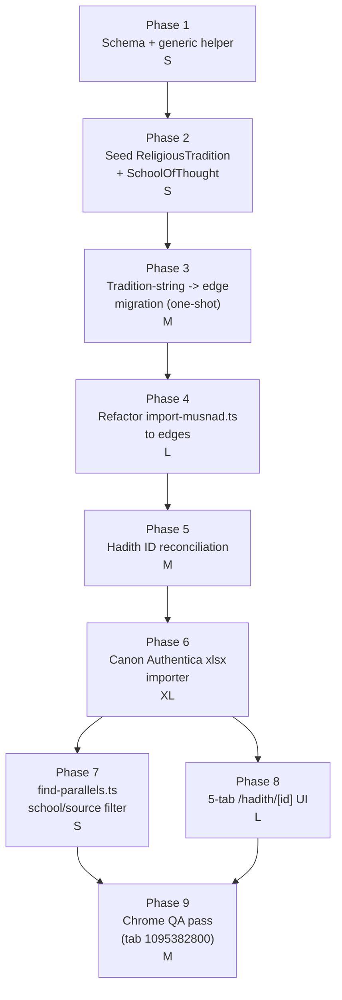

# Scholarship Layer Implementation Plan

**Plan ID:** scholarship-layer-plan
**Target repo:** `c:\Users\atooz\Programming\experiments\islamicapps`
**Author:** Prometheus (planner)
**Date:** 2026-04-10
**Status:** Ready for user confirmation (design locked, awaiting Phase 1 kickoff)

---

## 1. Executive Summary

This plan introduces a **scholarship layer** on top of the existing Hadith graph, extending it with two orthogonal taxonomies — `SchoolOfThought` (Islamic madhahib/sects) and `ReligiousTradition` (world religions) — bridged by exactly one `WITHIN_RELIGION` edge so that the comparative-religion layer stays cleanly disjoint from the intra-Islamic scholarship layer. On top of those axes we layer new edges for canon ownership, scholarly verdicts, commentaries, narrator acceptance, and practice-level observations. The critical data drop is the 100,217-row **Hadith-Pure-Canon-Authentica** xlsx, of which ~55k rows seed classical Sunni canon `Hadith` nodes and ~44k rows are modern anthology `ScholarVerdict` attachments keyed by Albani / Talidi / Ghumari. Before that import can safely run we must extract a generic `mergeNode` helper out of `neo4j-commit.ts` (fixing a latent dead-code `created` flag), migrate six stringly-typed `tradition = 'Ibadi'` write sites in `import-musnad.ts` to edge writes, kill the comma-delimited multi-tradition hack on `Narrator.tradition`, reconcile pre-existing UUID-id Sunni `Hadith` nodes onto a deterministic key space, and standardize `transmission_type` on SCREAMING_SNAKE_CASE. Once the importer lands, `find-parallels.ts` gets a `--school` / `--source` corpus filter so duplicate `Hadith` nodes do not get re-researched. Finally the `/hadith/[id]` page is refactored from its current ad-hoc layout into a strict 5-tab UI (Matn, Isnad, Scholarship, Parallels, Practice) and QA'd in Chrome tab `1095382800`. The effort is scoped to 9 sequential phases; every phase is independently reversible and idempotent.

---

## 2. Locked Design Recap

### 2.1 Node taxonomy (new labels in **bold**)

| Label | Business key | Notes |
|---|---|---|
| **`SchoolOfThought`** | `name` (unique) | Sunni, Ibadi, Shia-Imami, Shia-Zaydi, Hanafi, Maliki, Shafi'i, Hanbali, Ja'fari, Zaidi |
| **`ReligiousTradition`** | `name` (unique) | Islam, Judaism, Christianity, Zoroastrianism |
| **`Practice`** | `name` (unique) | New |
| `Scholar` | composite `pipeline_key = ${name_slug}::${death_year_hijri}` | Extended, not replaced |
| `ScholarVerdict` | composite `pipeline_key = ${scholar_id}::${hadith_id}::${source_work}` | Extended |
| `Commentary` | composite `pipeline_key = ${scholar_id}::${hadith_id}::${source_work}::${chunk_hash}` | Extended |

Every node retains a UUID `id` property in addition to its business key. Constraints on both.

### 2.2 Edge taxonomy (all new edges are disjoint from the comparative layer)

**Axis bridge (exactly one edge, enforced by seed script):**
- `(:SchoolOfThought)-[:WITHIN_RELIGION]->(:ReligiousTradition {name:'Islam'})`

**Scholarship edges:**
- `(:Hadith)-[:IN_SCHOOL]->(:SchoolOfThought)`
- `(:Scholar)-[:OF_SCHOOL]->(:SchoolOfThought)`
- `(:Scholar)-[:STUDENT_OF]->(:Scholar)`
- `(:Source)-[:CANON_OF]->(:SchoolOfThought)`
- `(:Hadith)-[:HAS_VERDICT]->(:ScholarVerdict)-[:ISSUED_BY]->(:Scholar)`
- `(:ScholarVerdict)-[:PUBLISHED_IN]->(:Source)` *(nullable)*
- `(:Hadith)-[:HAS_COMMENTARY]->(:Commentary)-[:AUTHORED_BY]->(:Scholar)`
- `(:Commentary)-[:PUBLISHED_IN]->(:Source)`
- `(:Narrator)-[:ACCEPTED_IN {status, source}]->(:SchoolOfThought)`
  - `status` enum: `THIQA | SADUQ | MAJHUL | DAIF | MATRUK | REJECTED`

**Practice edges:**
- `(:Hadith)-[:ESTABLISHES]->(:Practice)`
- `(:Practice)-[:OBSERVED_IN]->(:ReligiousTradition)`
- `(:Practice)-[:PARALLEL_PRACTICE {relation}]->(:Practice)`
  - `relation` enum: `SHARED_ORIGIN | ANALOGOUS | DERIVED_FROM | REFORMED_FROM`

### 2.3 Naming conventions (non-negotiable)
- Node labels: **PascalCase singular**
- Relationship labels: **SCREAMING_SNAKE_CASE** verb phrases
- Properties: **snake_case**
- Enum string values: **SCREAMING_SNAKE_CASE**
- Every node: UUID `id` + business-key MERGE anchor + `created_at` / `updated_at` datetimes
- Composite idempotency: `pipeline_key` with `::` delimiter, categorical fragments uppercased

### 2.4 Verdict enum
Classical canon rows: inserted as `ScholarVerdict {status: THABIT, source_work: <book>}`. Albani/Talidi/Ghumari anthology rows also emit `status: THABIT` (all xlsx rows have Arabic `ثابت`).

---

## 3. Critical Path Diagram



---

## 4. Phased Plan

### Phase 1 — Schema additions + generic helper extraction

**Complexity:** S

**Goal.** Expand `schema.ts` to declare constraints and indexes for the new scholarship/practice labels, and extract a single reusable `mergeNode(...)` helper from the duplicated MERGE blocks in `src/lib/comparative/neo4j-commit.ts`. The helper must carry a correct `created` flag derived from `event_type` semantics (not from timestamp comparison, which is the dead-code bug).

**Files to add/modify**
- `src/lib/db/schema.ts` (modify)
  - Add constraints: `SchoolOfThought.id`, `SchoolOfThought.name`, `Practice.id`, `Practice.name`, `Commentary.pipeline_key`, `ScholarVerdict.pipeline_key`, `Scholar.pipeline_key`
  - Add indexes: `Scholar.name_slug`, `Scholar.death_year_hijri`, `ScholarVerdict.status`, `Commentary.source_work`, `SchoolOfThought.name`, `Practice.name`, `Hadith.pipeline_key`
- `src/lib/db/neo4j-helpers.ts` (NEW)
  - Export `mergeNode<T>({ label, businessKey, businessKeyValue, createProps, matchProps }): Promise<{ id: string; created: boolean }>`
  - Export `mergeEdge({ from, to, type, props? })` with conflict-free ON CREATE / ON MATCH semantics
  - Use Neo4j's `apoc.do.when` pattern OR `SET n.created_at = coalesce(n.created_at, datetime())` idiom to derive `created` from whether `created_at` was pre-existing. The helper MUST return `created: !existed` via `WITH n, n.created_at IS NULL AS wasNew BEFORE MERGE` pattern — fix the line 162 bug where `(p.created_at = p.updated_at OR p.updated_at IS NULL)` misreports subsequent runs as creations.
- `src/lib/comparative/neo4j-commit.ts` (modify)
  - Replace the inline `MERGE (p:CrossCulturalParallel ...)` block and the `MotifTag` loop with calls to `mergeNode`/`mergeEdge`. Move the motif-tag loop inside a `runTransaction` (fixes the MEDIUM blocker about missing transaction wrapping).
  - Fix LOW blockers opportunistically: property naming drift at line 152 (`source_text_original` should carry the passage not the reference) and line 169 (`hadith_excerpt_en` should carry the hadith text not `scholarly_analysis`). Add an explicit `hadith_excerpt_en` argument to the helper call site and a new `source_reference` property distinct from `source_text_original`.

**Dependencies.** None.

**Acceptance criteria**
- Running `initializeSchema()` on an empty db creates every new constraint/index exactly once, no errors.
- Running it twice in a row logs `already exists` for every new constraint and throws no errors (idempotency).
- `mergeNode` unit test: first call returns `{ created: true }`, second call on same business key returns `{ created: false }` without mutating `created_at`.
- All existing comparative-layer tests still pass.
- `neo4j-commit.ts` `commitParallel()` callers still type-check; parallel re-commits (MATCH path) return `created:false`.

**Test strategy**
- **Unit.** New `src/lib/db/neo4j-helpers.test.ts` covering `mergeNode` create/match branches + `mergeEdge` idempotency.
- **Integration.** `npm run db:init` twice against a local Neo4j, diff `SHOW CONSTRAINTS` / `SHOW INDEXES` output.
- **Manual.** Re-run any existing comparative commit from `src/scripts/find-parallels.ts` against a sample hadith and confirm `created` correctly reports `false` on the second invocation (previously would report `true` wrongly).

**Rollback.** `git revert` the Phase 1 commit. The new constraints/indexes are additive — leaving them in place on an older branch causes no harm, but they can be dropped via `DROP CONSTRAINT <name>` / `DROP INDEX <name>` using the names recorded in `schema.ts`.

---

### Phase 2 — Tradition & SchoolOfThought seed bootstrap

**Complexity:** S

**Goal.** Guarantee that the 4 `ReligiousTradition` nodes, the 10 `SchoolOfThought` nodes, and the 10 `WITHIN_RELIGION` edges (each school → Islam) exist before any importer runs. Idempotent and safe on a populated db.

**Files to add/modify**
- `src/scripts/seed-taxonomy.ts` (NEW)
  - Reads a hardcoded constant array of traditions and schools.
  - Uses `mergeNode` from Phase 1.
  - Creates `WITHIN_RELIGION` edges only for schools whose parent is Islam (all 10, but the code must not hardcode that assumption — carry it as a `{ parent: 'Islam' }` field per school so future schools for other traditions are trivial).
- `package.json` (modify): add `"db:seed-taxonomy": "tsx src/scripts/seed-taxonomy.ts"`.

**Dependencies.** Phase 1 (schema + helpers).

**Acceptance criteria**
- After a fresh run on an empty db: `MATCH (rt:ReligiousTradition) RETURN count(rt)` = 4, `MATCH (s:SchoolOfThought) RETURN count(s)` = 10, `MATCH (:SchoolOfThought)-[:WITHIN_RELIGION]->(:ReligiousTradition) RETURN count(*)` = 10.
- Running the script a second time changes no counts and logs `created: false` for every upsert.
- Running against a db that already contains `ReligiousTradition {name:'Judaism'}` (from the comparative layer) does not duplicate it.

**Test strategy**
- **Integration.** Run against a dev db twice, compare counts.
- **Manual.** In Neo4j Browser, `MATCH (s:SchoolOfThought {name:'Ibadi'})-[:WITHIN_RELIGION]->(rt) RETURN rt.name` → `'Islam'`.

**Rollback.** `MATCH (s:SchoolOfThought) DETACH DELETE s` + `MATCH (rt:ReligiousTradition) WHERE NOT (rt)<-[:HAS_PARALLEL_FROM]-() DETACH DELETE rt`. Comparative-layer tradition nodes (Judaism, Christianity, Zoroastrianism) already in use must not be hard-deleted — rollback script must preserve any `ReligiousTradition` that has inbound relationships.

---

### Phase 3 — Tradition string → edge migration (one-shot idempotent)

**Complexity:** M

**Goal.** Convert every stringly-typed `n.tradition` property on `Hadith`, `Narrator`, `Scholar`, and `Source` nodes into corresponding `IN_SCHOOL` / `OF_SCHOOL` / `ACCEPTED_IN` / `CANON_OF` edges. Handles the comma-delimited multi-tradition hack from `import-musnad.ts:300-302` by splitting and emitting multiple edges.

**Files to add/modify**
- `src/scripts/migrate-tradition-to-edges.ts` (NEW)
  - Step A: For every `Hadith` / `Source` / `Scholar` with non-null `.tradition`, MERGE an edge to the matching `SchoolOfThought`.
  - Step B: For every `Narrator` with non-null `.tradition`, split on `,` and trim, emit an `ACCEPTED_IN` edge per token with `status = NULL` (unknown) and `source = 'legacy_migration'`.
  - Step C: Do NOT delete the legacy `.tradition` property in this phase — leave it as a sentinel so the migration is re-runnable. Deletion happens in Phase 4 after importers stop writing it.
  - Idempotent: every edge uses `MERGE`, every node keeps its UUID.
  - Dry-run mode via `--dry-run` flag logs counts without writing.
- `.omc/plans/scholarship-layer-plan.md` (this file) referenced in script header for provenance.

**Dependencies.** Phase 2 (schools must exist).

**Acceptance criteria**
- Dry-run on an empty db reports `0 nodes to migrate`.
- Dry-run on a populated Musnad db reports the expected counts (exact numbers to be captured during QA).
- Full run on a populated Musnad db:
  - Every `Hadith` with `tradition='Ibadi'` gains exactly one `[:IN_SCHOOL]->(SchoolOfThought {name:'Ibadi'})` edge.
  - Every `Narrator` with `tradition='Sunni, Ibadi'` gains two `ACCEPTED_IN` edges.
  - `MATCH (n) WHERE n.tradition IS NOT NULL AND NOT (n)-[:IN_SCHOOL|OF_SCHOOL|ACCEPTED_IN|CANON_OF]->() RETURN n` returns zero rows.
- Re-running the full run is a no-op.

**Test strategy**
- **Unit.** Parser test for the comma-split logic (`'Sunni, Ibadi'` → `['Sunni','Ibadi']`, `'Ibadi'` → `['Ibadi']`).
- **Integration.** Against a snapshot of the current Musnad db, run dry-run → full run → dry-run and confirm the second dry-run reports no work.
- **Manual.** Spot-check one Ibadi hadith in the UI, confirm no visible regression.

**Rollback.** Migration only adds edges, never deletes. Rollback is `MATCH ()-[r:IN_SCHOOL|OF_SCHOOL|ACCEPTED_IN|CANON_OF]->() WHERE r.source = 'legacy_migration' DELETE r`.

---

### Phase 4 — Refactor `import-musnad.ts` to write edges

**Complexity:** L

**Goal.** Retire all six tradition-string write sites, fix the destructive `--clear` path, delete the comma hack, keep deterministic `musnad_NNNN` ids, and standardize `transmission_type` on SCREAMING_SNAKE_CASE everywhere it is written or read.

**Files to add/modify**
- `src/scripts/import-musnad.ts` (modify)
  - Lines 211, 228, 297, 300-302, 429: replace `n.tradition = 'Ibadi'` with post-merge `MERGE (n)-[:IN_SCHOOL|OF_SCHOOL|CANON_OF]->(:SchoolOfThought {name:'Ibadi'})`. For `Narrator`, emit `ACCEPTED_IN` with `{status: coalesce(reliability_to_status, NULL), source: 'musnad_import'}`. Introduce a small local `reliabilityToStatus()` mapper.
  - Lines 567 and 638: replace `WHERE h.tradition = 'Ibadi'` with `WHERE EXISTS { MATCH (h)-[:IN_SCHOOL]->(:SchoolOfThought {name:'Ibadi'}) }` in the `--clear` path so the edge-based filter works post-migration.
  - Delete the `n.tradition = CASE WHEN ... + ', Ibadi' ...` comma hack (lines 300-302). Multi-tradition narrators now get multiple `ACCEPTED_IN` edges.
  - Standardize `transmission_type` writes: `'connected' | 'supplementary' | 'mursal'` → `'CONNECTED' | 'SUPPLEMENTARY' | 'MURSAL'` (SCREAMING_SNAKE_CASE). Grep the project for any read site.
  - Remove final `.tradition` property writes entirely. After this phase, the property no longer gets written; Phase 3's sentinel is still honored on legacy data but new writes never set it.
- `src/app/hadith/[id]/client-page.tsx` (modify, line ~71)
  - Update the `transmission_type` comparison from `'MUTAWATIR'` to the new SCREAMING_SNAKE_CASE set (`'CONNECTED' | 'SUPPLEMENTARY' | 'MURSAL' | 'MUTAWATIR' | 'AHAD'`). Introduce a proper `HadithPageProps` type (fixes MEDIUM blocker about `any`).
- `src/lib/db/schema.ts` (modify)
  - If not already present, add an index `Hadith.pipeline_key` so `--clear` can scope by book prefix.
- `package.json` (modify): ensure `db:import-musnad` still runs end-to-end.

**Dependencies.** Phase 3 (migration must have run at least once, so legacy data is already edge-backed).

**Acceptance criteria**
- Full re-import of Musnad corpus after Phase 3 migration yields identical `Hadith` counts and identical deterministic ids (`musnad_0001`..`musnad_NNNN`).
- `MATCH (h:Hadith) WHERE h.id STARTS WITH 'musnad_' AND h.tradition IS NOT NULL RETURN count(h)` = 0 after re-import.
- `--clear` path no longer uses string filter; running `db:import-musnad -- --clear` removes only Ibadi-edge-bound hadiths and leaves Sunni comparative-layer hadiths intact.
- `client-page.tsx` no longer has `any`-typed `hadith` prop.
- All `transmission_type` values written by the importer are uppercase; all UI comparisons use the same casing.

**Test strategy**
- **Unit.** `reliabilityToStatus` mapper test (`'ثقة'` → `'THIQA'`, etc.).
- **Integration.** On a dev db, run Phase 3 → Phase 4 import → assert counts → run `--clear` → assert only Ibadi-edge-bound hadiths deleted → re-run import → assert identical counts.
- **Manual.** Open `/hadith/musnad_0001` and confirm transmission-type badge still renders (regression check on the casing change).

**Rollback.** `git revert` the Phase 4 commit. The migration from Phase 3 is idempotent and stays in place, so a reverted importer can still run correctly against a post-migration db.

---

### Phase 5 — Hadith ID reconciliation for pre-existing UUID-id Sunni hadiths

**Complexity:** M

**Goal.** Pre-existing Sunni `Hadith` nodes (created via `import-datasets.ts:522` with `randomUUID()`) must be reconciled onto a deterministic key space (`${book_slug}_${hadith_no_padded}`) before the canon importer starts MERGE-ing on those same keys. Without this step, the xlsx importer would create ~55k duplicate `Hadith` nodes.

**Files to add/modify**
- `src/scripts/reconcile-hadith-ids.ts` (NEW)
  - For every `Hadith` node with a UUID-shaped `id`, derive the deterministic `new_id = ${book_slug}_${String(hadith_no).padStart(5,'0')}` from `(h.source, h.hadith_no)`. If either is missing, log and skip.
  - Write the new id to a new `pipeline_key` property first, do NOT overwrite the UUID `id` (which is a constraint-backed primary key). Instead, move all inbound relationships from the old node to a newly merged `Hadith {pipeline_key: $new_id}` using Neo4j's `apoc.refactor.mergeNodes` or a manual edge-rewrite query, then delete the orphaned UUID node.
  - Supports `--dry-run` and a `--book bukhari` scope filter so the operator can migrate one book at a time.
  - Writes a JSON audit log to `.omc/logs/reconcile-<timestamp>.json` mapping `{ old_uuid, new_pipeline_key, moved_edges_count }`.
- `src/lib/db/schema.ts` (modify): add a non-unique index on `Hadith.pipeline_key` if Phase 4 did not already.

**Dependencies.** Phase 4 (the importer refactor stabilizes the id convention; we need both importers reading/writing the same key).

**Acceptance criteria**
- Dry-run on a db containing only Musnad hadiths reports `0 nodes to reconcile` (Musnad already uses deterministic ids).
- Dry-run on a db containing Sunni hadiths with UUID ids reports the exact count and emits a sample of derived keys for operator review.
- Full run on that db:
  - Preserves inbound `HAS_NARRATOR`, `HAS_CHAIN`, `HAS_PARALLEL`, `HAS_VERDICT`, `HAS_COMMENTARY` edges (count before = count after).
  - Leaves no orphan UUID-id Sunni `Hadith` nodes.
  - Idempotent on re-run.
- The audit log is written.

**Test strategy**
- **Unit.** Key-derivation test: `('bukhari', 7)` → `'bukhari_00007'`.
- **Integration.** On a db seeded with 10 fake UUID-id Sunni hadiths each with 3 inbound edges, run dry-run → full run → assert edge counts preserved, old nodes gone, new nodes have correct `pipeline_key`.
- **Manual.** Operator reviews the audit log, spot-checks 3 entries in Neo4j Browser.

**Rollback.** The audit log is reversible: a companion `reconcile-hadith-ids-undo.ts` script (bundled in the same PR) reads the JSON and re-creates UUID nodes and moves edges back. Because this phase touches primary keys, the operator MUST back up the Neo4j db (file-level dump) before running. The plan mandates `neo4j-admin database dump` as a pre-step in the runbook section of the PR description.

---

### Phase 6 — Canon Authentica xlsx importer

**Complexity:** XL

**Goal.** Ingest the 100,217-row `datasets/hadith-data/Hadith-Pure-Canon-Authentica (1).xlsx` into the graph. Classical canon rows (~55k) become `Hadith` nodes with deterministic keys and `IN_SCHOOL`/`CANON_OF` edges; anthology rows (~44k) become `ScholarVerdict` nodes attached to the classical `Hadith` node they reference, plus `Scholar` nodes for Albani / Talidi / Ghumari and `Source` nodes for each anthology work. All in batched transactions.

**Files to add/modify**
- `datasets/06_pure_canon_preprocess.py` (NEW)
  - Reads the xlsx, Sheet1 only.
  - Skips the first row per book (metadata).
  - Emits two CSVs to `datasets/pure-canon/`:
    - `classical_hadiths.csv`: columns `pipeline_key, source, hadith_no, global_index, matn_arabic, isnad_arabic, topics_raw`
    - `anthology_verdicts.csv`: columns `pipeline_key, target_hadith_pipeline_key, scholar_slug, scholar_death_hijri, source_work, verdict, topics_raw`
  - Classical-vs-anthology routing is based on the source-book name (hardcoded set of 10 classical books; everything else is anthology).
  - For classical rows: `pipeline_key = ${book_slug}_${String(hadith_no or global_index).padStart(5,'0')}`. If `hadith_no` is missing (47% of rows), fall back to `global_index` with a `g_` prefix (`bukhari_g_00001`) so the two keys never collide.
  - For anthology rows: resolve `target_hadith_pipeline_key` by cross-referencing the `global_index` column to the corresponding classical row; drop rows where the target cannot be resolved (log count).
  - Scholar slug derivation: NFKD-normalize Arabic name, strip diacritics, collapse whitespace to `_`, lowercase.
  - Emits a `preprocess_stats.json` with row counts, dedup counts, dropped-row counts.
- `src/scripts/import-pure-canon.ts` (NEW)
  - Two-pass importer reading the two CSVs.
  - **Pass 1 (classical):** For each row, MERGE `Source` (by `name`), MERGE `SchoolOfThought {name:'Sunni'}` (seeded in Phase 2, lookup only), MERGE `Hadith {pipeline_key}` with `mergeNode`, MERGE edges `(:Hadith)-[:IN_SCHOOL]->(:SchoolOfThought)` and `(:Source)-[:CANON_OF]->(:SchoolOfThought)`. Batch 1000 rows per `runTransaction`.
  - **Pass 2 (anthology):** For each row, MERGE `Scholar {pipeline_key: ${scholar_slug}::${death_hijri}}`, MERGE `Source {name: source_work}`, MERGE `ScholarVerdict {pipeline_key: ${scholar_id}::${hadith_id}::${source_work}}` with `status: THABIT`, MERGE edges `(:Hadith)-[:HAS_VERDICT]->(:ScholarVerdict)`, `(:ScholarVerdict)-[:ISSUED_BY]->(:Scholar)`, `(:ScholarVerdict)-[:PUBLISHED_IN]->(:Source)`, `(:Scholar)-[:OF_SCHOOL]->(:SchoolOfThought {name:'Sunni'})`. Batch 1000 per transaction.
  - CLI flags: `--dry-run`, `--sample N` (process only first N rows of each pass), `--pass [classical|anthology|both]`, `--resume-from <row>`.
  - Progress bar + periodic checkpoint to `.omc/state/pure-canon-import.json` so interrupted runs can resume.
  - Topic tags in col 7 are NOT linked to `MotifTag` in this phase — they are stored as `Hadith.topics_raw` (comma-joined) for later processing to avoid blocking the import on a parallel concern. A follow-up phase (out of scope for this plan) will normalize them.
- `package.json` (modify): add `db:import-pure-canon` script.
- `datasets/pure-canon/.gitignore` (NEW): ignore the generated CSVs.

**Dependencies.** Phase 5 (UUID reconciliation must be complete — otherwise the importer will MERGE onto deterministic keys that collide with UUID-keyed pre-existing nodes).

**Acceptance criteria**
- Python preprocessor run produces two CSVs with row counts approximately `classical=55k ±2k`, `anthology=44k ±2k`, plus a stats JSON with non-empty `dropped_rows` counts logged per reason.
- Dry-run of the importer on a 100-row sample reports `created: 100` on first run, `created: 0` on second run, and shows no errors.
- Full run stats report:
  - Classical canon `Hadith` count ≈ 55k, all with `pipeline_key`, all linked to Sunni `SchoolOfThought`.
  - Anthology `ScholarVerdict` count ≈ 44k.
  - Unique `Scholar` count = 4 ± subvolume breakdowns for Talidi (Albani, Talidi-vol1, Talidi-vol2, Ghumari; exact count to be logged).
  - `Source` nodes for each anthology work, each with `CANON_OF` edge to Sunni.
- Re-running the full import is a near-no-op (only `updated_at` changes on matched nodes, all `created:false`).
- `MATCH (h:Hadith)-[:HAS_VERDICT]->(v:ScholarVerdict)-[:ISSUED_BY]->(s:Scholar) WHERE s.name_slug='albani' RETURN count(v)` returns a non-zero count matching the Albani row count from the CSV stats.
- Transactions are batched: a deliberate `SIGINT` mid-import leaves the db in a consistent state and the checkpoint file reflects the last successful batch.

**Test strategy**
- **Unit.** Python preprocessor tests for the classical-vs-anthology router and the pipeline_key fallback logic.
- **Unit.** TS importer tests for the scholar-slug normalization and the verdict-key composition.
- **Integration.** Run `--sample 100` on a dev db twice; diff counts.
- **Integration.** Full run on a dev db (one-time, ~30-60 min expected); record stats.
- **Manual.** Open a known Bukhari hadith in the UI and verify the Scholarship tab lists Albani's verdict.

**Rollback.** Delete the Sunni-scoped hadith imports: `MATCH (h:Hadith)-[:IN_SCHOOL]->(:SchoolOfThought {name:'Sunni'}) WHERE h.pipeline_key STARTS WITH 'bukhari_' OR ... DETACH DELETE h`. Delete `ScholarVerdict` nodes similarly. The checkpoint file under `.omc/state/pure-canon-import.json` lets the operator resume instead of rolling back if the failure is transient.

---

### Phase 7 — Update `find-parallels.ts` with school/source filter

**Complexity:** S

**Goal.** After Phase 6, the corpus contains 55k new classical Sunni hadiths. The parallels research script currently (lines 78-84) is corpus-agnostic and would re-research already-parallel'd nodes or create duplicate `Hadith` nodes. Add filters to scope the research lane.

**Files to add/modify**
- `src/scripts/find-parallels.ts` (modify)
  - Add CLI flags: `--school <name>`, `--source <name>`, `--limit N`, `--skip-existing` (default on).
  - The node-fetch query gains a `WHERE EXISTS { MATCH (h)-[:IN_SCHOOL]->(:SchoolOfThought {name:$school}) }` clause when `--school` is set, and `WHERE h.source = $source` when `--source` is set.
  - `--skip-existing` filters out hadiths that already have ≥1 `HAS_PARALLEL` edge.
  - The importer writes (via `commitParallel`) must look up the `Hadith` node by `pipeline_key` not UUID, to prevent duplicate-node creation in the path where the script was previously relying on random new UUIDs.
- `src/scripts/find-parallels.test.ts` (NEW or extend): mock Neo4j and assert filter clauses are composed correctly.

**Dependencies.** Phase 6 (need Sunni `IN_SCHOOL` edges to exist so `--school=Sunni` is meaningful).

**Acceptance criteria**
- Running `find-parallels.ts --school=Sunni --source=bukhari --limit=10` returns at most 10 Bukhari hadiths scoped to the Sunni school and never double-processes a node that already has a `HAS_PARALLEL` edge.
- Running without flags preserves current behaviour (backward compatible).
- No duplicate `Hadith` nodes are ever created — validated by `MATCH (h:Hadith) WITH h.pipeline_key AS k, count(*) AS c WHERE c > 1 RETURN k, c` returning zero rows after a run.

**Test strategy**
- **Unit.** Query-builder test for the filter composition.
- **Integration.** Against a dev db post-Phase-6, run with `--school=Sunni --limit=5`, confirm 5 Bukhari hadiths processed, confirm no duplicates.
- **Manual.** Spot-check the Neo4j Browser for `(h:Hadith)-[:HAS_PARALLEL]->(p)` count before vs after.

**Rollback.** `git revert` — the script is a research tool, no persistent data-model changes.

---

### Phase 8 — UI drill-in refactor: 5-tab `/hadith/[id]` layout

**Complexity:** L

**Goal.** Refactor `src/app/hadith/[id]/client-page.tsx` and `page.tsx` into a strict 5-tab layout:

1. **Matn** — hadith text (Arabic + English translation if present)
2. **Isnad** — the chain of narrators, each linking to `/narrator/[id]`, with `ACCEPTED_IN` badges per school
3. **Scholarship** — list of `ScholarVerdict` edges (grouped by scholar, showing source work), plus `Commentary` entries
4. **Parallels** — existing `CrossCulturalParallel` rendering (regression-safe)
5. **Practice** — `ESTABLISHES` edges to `Practice` nodes, with `OBSERVED_IN` tradition badges and `PARALLEL_PRACTICE` relations

Plus: confirm the data-loading path for verdicts actually populates (MEDIUM blocker) and fix `TraditionBadge` to carry explicit school entries (LOW blocker).

**Files to add/modify**
- `src/app/hadith/[id]/page.tsx` (modify)
  - Extend `getHadithById` call-site to include verdicts, commentaries, practices. Verify `getHadithById` in `src/lib/db` already returns verdicts — if not, extend its Cypher query in a companion edit under `src/lib/db/hadith-queries.ts`.
- `src/lib/db/hadith-queries.ts` (modify or NEW if missing)
  - Extend the `getHadithById` Cypher to OPTIONAL MATCH the new edges: verdicts, commentaries, practices, school. Return them as nested shape.
- `src/app/hadith/[id]/client-page.tsx` (modify)
  - Introduce `type HadithPageProps` replacing `any`.
  - Introduce a `<Tabs>` shadcn primitive (or equivalent) with 5 tab panels.
  - Tab 1 Matn: existing matn rendering.
  - Tab 2 Isnad: existing chain rendering, but each narrator chip carries `ACCEPTED_IN` status badges via `TraditionBadge`.
  - Tab 3 Scholarship: groups `ScholarVerdict` by `Scholar`, renders scholar name + death year, lists verdicts with source-work link, lists commentaries with excerpt.
  - Tab 4 Parallels: keep the existing `CrossCulturalParallelCard` rendering unchanged to avoid regression.
  - Tab 5 Practice: renders `Practice` nodes linked via `ESTABLISHES`, with `OBSERVED_IN` tradition icons and `PARALLEL_PRACTICE` relation chips.
- `src/components/TraditionBadge.tsx` (modify)
  - Add explicit entries to `TRADITION_STYLES` for each new `SchoolOfThought` name (Sunni, Ibadi, Shia-Imami, Shia-Zaydi, Hanafi, Maliki, Shafi'i, Hanbali, Ja'fari, Zaidi). Keep the existing tradition entries (Islam, Judaism, Christianity, Zoroastrianism). Decide at implementation time whether to rename to `GroupBadge` or keep `TraditionBadge` and accept that it now serves both axes — plan recommendation is to **keep the name** to avoid a cross-cutting rename.
- `src/components/ScholarVerdictCard.tsx` (NEW) — one card per verdict.
- `src/components/PracticeCard.tsx` (NEW) — one card per practice with OBSERVED_IN + PARALLEL_PRACTICE rendering.
- `src/lib/comparative/pipeline.ts` (modify)
  - Wire the previously-unused `StructuredAssessment.parsed` flag so it gates downstream processing. LOW blocker.

**Dependencies.** Phase 6 (need verdicts and canon hadiths in the graph to render anything meaningful in Tab 3). Can start UI scaffolding in parallel once Phase 4 lands, but final QA must wait for Phase 6 data.

**Acceptance criteria**
- `/hadith/musnad_0001` renders all 5 tabs without runtime errors. Empty tabs (e.g., no verdicts) show a muted empty-state message.
- `/hadith/bukhari_00001` (post-Phase-6) renders Tab 3 with at least one verdict from Albani, Talidi, or Ghumari if the row existed in the xlsx.
- `/narrator/[id]` shows per-school `ACCEPTED_IN` badges where applicable.
- Tab 4 still renders existing `CrossCulturalParallel` data (no regression).
- `client-page.tsx` has zero `any` types; `tsc --noEmit` is clean.

**Test strategy**
- **Unit.** Component tests for `<ScholarVerdictCard>`, `<PracticeCard>`, and the updated `<TraditionBadge>` with new school entries.
- **Integration.** Storybook stories (if Storybook is wired) or Playwright smoke test hitting the 5 tab panels.
- **Manual.** Chrome tab `1095382800` QA per Phase 9.

**Rollback.** The UI changes are git-revertible without data-layer impact. The `hadith-queries.ts` extension is additive — leaving it in place on an older branch causes no harm.

---

### Phase 9 — Chrome QA pass (tab `1095382800`)

**Complexity:** M

**Goal.** Execute the full QA test plan in Section 6 against Chrome tab `1095382800` and document any regressions. Produce a signoff report.

**Files to add/modify**
- `.omc/logs/qa-scholarship-layer-<date>.md` (NEW, written by QA agent)

**Dependencies.** Phases 1-8 complete.

**Acceptance criteria**
- Every test in Section 6 has a pass/fail entry and evidence link (screenshot or Cypher output snippet).
- Zero P0 failures. P1 failures trigger a fix loop back to the responsible phase.

**Test strategy.** See Section 6 QA Test Plan.

**Rollback.** N/A — QA is a reporting phase.

---

## 5. Risk Register

| # | Risk | Probability | Impact | Mitigation |
|---|---|---|---|---|
| R1 | Phase 5 reconciliation deletes inbound edges | L | H | Pre-phase `neo4j-admin database dump`; audit log written before each edge move; companion undo script; run on dev db first |
| R2 | xlsx preprocessor misrouting classical vs anthology rows | M | H | Hardcoded classical-book allowlist + explicit drop counter; dry-run with stats before full import; operator review of stats JSON |
| R3 | Deterministic `pipeline_key` collision between `hadith_no` and `global_index` fallback rows | L | H | `g_` prefix on `global_index`-derived keys guarantees disjoint key spaces |
| R4 | Scholar slug collisions (two scholars with same Arabic name) | M | M | Composite `pipeline_key = slug::death_hijri`; log collisions to review queue |
| R5 | Phase 3 migration run on a db where the Phase 4 importer has already partially run | L | M | Migration is idempotent on MERGE; both phases use the same edge types; operator runbook mandates Phase 3 before Phase 4 |
| R6 | `transmission_type` case standardization breaks existing UI reads | M | M | Grep all read sites in Phase 4; add a small normalizer shim at the data-fetch boundary as a safety net |
| R7 | 55k+ row import exhausts Neo4j memory | M | H | Batch size 1000 per transaction; checkpoint file for resume; `--sample` flag for dry-runs |
| R8 | `getHadithById` does not currently return verdicts; Tab 3 renders empty | M | M | Phase 8 explicitly extends `hadith-queries.ts`; QA test T08 verifies |
| R9 | `mergeNode` helper still has the created-flag bug if the operator uses the wrong pattern | L | M | Unit test in Phase 1 explicitly asserts `{created:false}` on second run |
| R10 | `find-parallels.ts` creates duplicate Hadith nodes during Phase 6 window (before Phase 7 filter lands) | M | H | Phase 7 is gated to run only after Phase 6; operators must NOT run `find-parallels.ts` during the window; add a runbook warning |
| R11 | Comma-hack deletion (Phase 4) loses narrator multi-school membership data | L | H | Phase 3 emits `ACCEPTED_IN` edges BEFORE Phase 4 deletes the string property; Phase 3 is mandatory before Phase 4 |
| R12 | Practice taxonomy is undefined (no seed data for `Practice` nodes) | H | L | Plan explicitly scopes `Practice` as empty at end of Phase 6; Tab 5 renders empty-state; follow-up effort will seed practices |

---

## 6. QA Test Plan

All tests run in Chrome tab `1095382800` where a browser is involved. Neo4j queries run in the Neo4j Browser or `cypher-shell`.

| Test ID | Phase verified | Prerequisite state | Steps | Expected result | URL |
|---|---|---|---|---|---|
| **T01** | P1 | Fresh dev db | 1. Run `npm run db:init` twice | First run creates constraints/indexes; second run logs `already exists` for every one; zero errors | n/a |
| **T02** | P2 | Empty db after T01 | 1. Run `npm run db:seed-taxonomy` twice. 2. Cypher: `MATCH (rt:ReligiousTradition) RETURN count(rt); MATCH (s:SchoolOfThought) RETURN count(s); MATCH (:SchoolOfThought)-[:WITHIN_RELIGION]->(:ReligiousTradition {name:'Islam'}) RETURN count(*)` | Counts = 4, 10, 10 after first run; unchanged after second run | n/a |
| **T03** | P3 | Clean db with seed taxonomy (post-T02) | 1. Run `migrate-tradition-to-edges --dry-run` | Reports `0 nodes to migrate` | n/a |
| **T04** | P3 | Populated Musnad db (pre-Phase-4 importer state) | 1. Dry-run migration, record counts. 2. Full run. 3. Cypher: `MATCH (h:Hadith) WHERE h.tradition='Ibadi' AND NOT (h)-[:IN_SCHOOL]->() RETURN count(h)`. 4. Cypher: `MATCH (n:Narrator) WHERE n.tradition CONTAINS ',' RETURN n LIMIT 5` then confirm each has ≥2 `ACCEPTED_IN` edges | Post-run count = 0; comma-tradition narrators have multiple edges; no data loss (Hadith/Narrator counts unchanged) | n/a |
| **T05** | P4 | Db post-T04 | 1. Run `db:import-musnad -- --clear`. 2. Cypher: `MATCH (h:Hadith)-[:IN_SCHOOL]->(:SchoolOfThought {name:'Ibadi'}) RETURN count(h)` before and after. 3. Re-import without `--clear` twice. 4. Cypher: `MATCH (h:Hadith) WHERE h.id STARTS WITH 'musnad_' AND h.tradition IS NOT NULL RETURN count(h)` | `--clear` only removes Ibadi-edge hadiths; re-import is idempotent; post-import count of hadiths with non-null tradition = 0 | n/a |
| **T06** | P6 | Db post-T05, Phase 5 reconciliation complete | 1. Run Python preprocessor. 2. Run `import-pure-canon --sample 100 --dry-run` twice. 3. Review stats JSON | First dry-run: `created:100`; second: `created:0`; stats JSON shows expected classical/anthology split | n/a |
| **T07** | P6 | Db post-T06 | 1. Full import run. 2. Cypher stats: classical Hadith count (`MATCH (h:Hadith)-[:IN_SCHOOL]->(:SchoolOfThought {name:'Sunni'}) RETURN count(h)`), ScholarVerdict count, unique Scholar count, Source count for Albani/Talidi/Ghumari | Classical Hadith ≈ 55k; ScholarVerdict ≈ 44k; Scholar count matches CSV stats; Source nodes exist for all 3 anthology scholars with `CANON_OF` edges | n/a |
| **T08** | P8 | Db post-T05 (Musnad only, Phase 8 UI deployed) | 1. Open `/hadith/musnad_0001` in Chrome tab `1095382800`. 2. Click through all 5 tabs | All 5 tabs render; empty tabs show empty-state; no runtime errors in console | `http://localhost:3000/hadith/musnad_0001` |
| **T09** | P8 | Db post-T07 (canon imported, UI deployed) | 1. Open `/hadith/bukhari_00001`. 2. Click Scholarship tab | Tab 3 shows at least one verdict from Albani/Talidi/Ghumari where the xlsx row existed; Source badge links to correct anthology work | `http://localhost:3000/hadith/bukhari_00001` |
| **T10** | P8 | Db post-T04 | 1. Open a narrator page known to appear in both Sunni and Ibadi corpora. 2. Look for school badges on the narrator header | Narrator shows multiple `ACCEPTED_IN` status badges, one per school | `http://localhost:3000/narrator/<id>` (operator picks from DB) |
| **T11** | P8 | Db post-T07 with pre-existing `CrossCulturalParallel` data | 1. Open a Sunni hadith known to have a parallel (from current comparative layer). 2. Click Parallels tab | Tab 4 renders existing `CrossCulturalParallelCard` content unchanged; regression check | `http://localhost:3000/hadith/<id>` |
| **T12** | P7 | Db post-T07 | 1. Run `find-parallels.ts --school=Sunni --source=bukhari --limit=5`. 2. Cypher: `MATCH (h:Hadith) WITH h.pipeline_key AS k, count(*) AS c WHERE c > 1 RETURN k, c` | 5 Bukhari hadiths processed; no duplicate pipeline_keys; script log shows `skipped: N already-parallel'd` entries | n/a |

Additional browser observations in tab `1095382800`:
- Chrome DevTools Console must be clean (no red errors) for T08, T09, T10, T11.
- Chrome DevTools Network tab must show no 500 responses from the Next.js server for those routes.

---

## 7. File Tree of New/Modified Files

Legend: **[NEW]** = new file, **[MOD]** = modified file, complexity markers S/M/L/XL.

```
islamicapps/
├── src/
│   ├── lib/
│   │   ├── db/
│   │   │   ├── schema.ts                                   [MOD] S
│   │   │   ├── neo4j-helpers.ts                            [NEW] M
│   │   │   ├── neo4j-helpers.test.ts                       [NEW] S
│   │   │   └── hadith-queries.ts                           [MOD or NEW] M
│   │   └── comparative/
│   │       ├── neo4j-commit.ts                             [MOD] M
│   │       └── pipeline.ts                                 [MOD] S
│   ├── scripts/
│   │   ├── seed-taxonomy.ts                                [NEW] S
│   │   ├── migrate-tradition-to-edges.ts                   [NEW] M
│   │   ├── import-musnad.ts                                [MOD] L
│   │   ├── reconcile-hadith-ids.ts                         [NEW] M
│   │   ├── reconcile-hadith-ids-undo.ts                    [NEW] S
│   │   ├── import-pure-canon.ts                            [NEW] XL
│   │   ├── find-parallels.ts                               [MOD] S
│   │   └── find-parallels.test.ts                          [NEW or MOD] S
│   ├── components/
│   │   ├── TraditionBadge.tsx                              [MOD] S
│   │   ├── ScholarVerdictCard.tsx                          [NEW] S
│   │   └── PracticeCard.tsx                                [NEW] S
│   └── app/
│       └── hadith/
│           └── [id]/
│               ├── page.tsx                                [MOD] S
│               └── client-page.tsx                         [MOD] L
├── datasets/
│   ├── 06_pure_canon_preprocess.py                         [NEW] L
│   └── pure-canon/
│       ├── .gitignore                                      [NEW] S
│       ├── classical_hadiths.csv                           [GENERATED]
│       ├── anthology_verdicts.csv                          [GENERATED]
│       └── preprocess_stats.json                           [GENERATED]
├── package.json                                            [MOD] S
├── .omc/
│   ├── plans/
│   │   └── scholarship-layer-plan.md                       [NEW] (this file)
│   ├── state/
│   │   └── pure-canon-import.json                          [GENERATED]
│   └── logs/
│       ├── reconcile-<timestamp>.json                      [GENERATED]
│       └── qa-scholarship-layer-<date>.md                  [NEW during P9]
```

Aggregate complexity: **1 XL**, **4 L**, **7 M**, **~13 S**.

---

## 8. Open Questions (to confirm with user before Phase 1 kickoff)

1. **Pre-existing Sunni hadith count.** How many pre-existing Sunni `Hadith` nodes currently exist in the dev db with UUID-shaped ids? Phase 5 scope depends on this. If the count is zero (e.g., the dev db is fresh), Phase 5 becomes a no-op and can be skipped in practice but the code still ships as defense-in-depth.
2. **Reliability → status mapping.** The `ACCEPTED_IN.status` enum is `THIQA | SADUQ | MAJHUL | DAIF | MATRUK | REJECTED`. The Musnad importer currently stores `reliability` as free-form Arabic strings. Should Phase 4 use an explicit mapping table (and if so, who provides the canonical mapping?), or write `NULL` and defer the mapping to a follow-up phase? Plan assumes an explicit mapping with a small hand-curated table in `import-musnad.ts` but will fall back to `NULL` for any unmatched value.
3. **Talidi sub-volumes.** The brief mentions "Talidi + subvolumes". Should each sub-volume become a distinct `Source` node (and thus the same scholar maps to multiple sources), or collapse under one `Source {name:'Talidi'}`? Plan assumes one `Source` per sub-volume, keyed on the exact source-work string in the xlsx, because that preserves maximum information.
4. **Scholar canonicalization for Albani.** Does Al-Albani already exist as a `Scholar` node in the graph (from the comparative layer)? If so, his `pipeline_key` must match whatever the Phase 6 importer derives. Plan assumes the importer's `slug::death_hijri` key is authoritative and any pre-existing Albani node will either already match or will be handled by the `mergeNode` helper's business-key MERGE.
5. **`transmission_type` allowed values.** The brief names `CONNECTED`, `SUPPLEMENTARY`, `MURSAL` from `import-musnad.ts` and `MUTAWATIR` from `client-page.tsx`. Is `AHAD` also expected? Plan proposes the set `{CONNECTED, SUPPLEMENTARY, MURSAL, MUTAWATIR, AHAD}` — please confirm or prune.
6. **`Practice` seed data.** Phase 6 does not seed `Practice` nodes. Tab 5 of the UI will render empty until a separate practice-seeding effort runs. Is that acceptable, or should Phase 8 be gated behind a mini-seed of 5-10 common practices (Salah, Sawm, Zakat, Hajj, Shahada) for demonstration?
7. **Neo4j backup responsibility.** Phase 5 mandates a file-level `neo4j-admin database dump` before reconciliation. Is that the operator's responsibility to run manually, or should the plan include a script that invokes it? Plan currently assumes manual operator responsibility documented in the Phase 5 runbook.
8. **Topic-tag normalization scope.** The xlsx col 7 `عنوان` comma-separated topic tags are stored as raw strings in Phase 6. Is normalizing them into `MotifTag` nodes in-scope for this plan, or deliberately deferred? Plan defers it.
9. **Hadith ID fallback prefix `g_`.** The `g_` prefix disambiguates global-index-derived keys from hadith-number-derived keys. Is the prefix string acceptable, or should it be something else (`gi_`, `idx_`, `global_`)? Plan uses `g_`.
10. **find-parallels.ts `--skip-existing` default.** Plan defaults `--skip-existing` to ON to prevent duplicate research cost. Confirm this is the desired default.

---

## 9. Rollback Appendix (full-effort revert)

If mid-effort the decision is made to abandon the scholarship layer entirely:

1. **Data rollback (Neo4j).**
   - Restore from the pre-Phase-5 `neo4j-admin database dump` backup. This is the cleanest path — it reverts the id reconciliation, all canon imports, all migration edges, and all seed nodes in one step.
   - If no backup exists (which would be a process failure): execute the following Cypher in order:
     - `MATCH (v:ScholarVerdict) DETACH DELETE v` (Phase 6)
     - `MATCH (c:Commentary) WHERE c.pipeline_key CONTAINS '::' DETACH DELETE c` (Phase 6, new commentaries only)
     - `MATCH (h:Hadith)-[:IN_SCHOOL]->(:SchoolOfThought {name:'Sunni'}) WHERE h.pipeline_key STARTS WITH 'bukhari_' OR h.pipeline_key STARTS WITH 'muslim_' OR h.pipeline_key STARTS WITH 'nasai_' OR h.pipeline_key STARTS WITH 'abudawud_' OR h.pipeline_key STARTS WITH 'tirmidhi_' OR h.pipeline_key STARTS WITH 'ibnmajah_' OR h.pipeline_key STARTS WITH 'muwatta_' OR h.pipeline_key STARTS WITH 'darimi_' OR h.pipeline_key STARTS WITH 'musnadahmad_' OR h.pipeline_key STARTS WITH 'musnadshafii_' DETACH DELETE h` (Phase 6)
     - Run `reconcile-hadith-ids-undo.ts` using the audit log from Phase 5
     - `MATCH ()-[r:IN_SCHOOL|OF_SCHOOL|ACCEPTED_IN|CANON_OF|HAS_VERDICT|ISSUED_BY|HAS_COMMENTARY|AUTHORED_BY|PUBLISHED_IN|ESTABLISHES|OBSERVED_IN|PARALLEL_PRACTICE]-() DELETE r` (Phases 3, 4, 6, 8)
     - `MATCH (n:SchoolOfThought) DETACH DELETE n` (Phase 2)
     - `MATCH (p:Practice) DETACH DELETE p` (Phase 6/8)
     - Preserve any `ReligiousTradition` node with inbound comparative-layer edges; delete only the ones created by this plan (none, if the seed script used MERGE correctly).
   - Drop the new constraints/indexes added in Phase 1 by name.

2. **Code rollback (git).**
   - `git revert` the merge commits for Phases 1 through 8 in reverse order (P8 → P1).
   - Do not force-push; create revert commits on a `revert/scholarship-layer` branch and PR them.
   - Delete the `datasets/pure-canon/` generated directory and the `.omc/state/pure-canon-import.json` checkpoint.

3. **Verification.**
   - Run the existing pre-plan test suite and the existing `verify-db.ts` script.
   - Open `/hadith/musnad_0001` in Chrome tab `1095382800` and confirm the pre-plan UI layout (single-page, no tabs) renders correctly.
   - Confirm `MATCH (h:Hadith) WHERE h.tradition IS NOT NULL RETURN count(h)` returns the pre-migration count (should match the T04 baseline).

4. **Communication.**
   - Post a summary in `.omc/logs/rollback-scholarship-layer-<date>.md` listing which phases were landed, which were reverted, and any residual data (e.g., pre-existing `SchoolOfThought` nodes that were kept because other tools had already started depending on them).

The plan is designed so that rollback of any single phase does not cascade into rollback of prior phases. Phases 1, 2, 3, and 7 are purely additive and need not be rolled back even if later phases are reverted.
